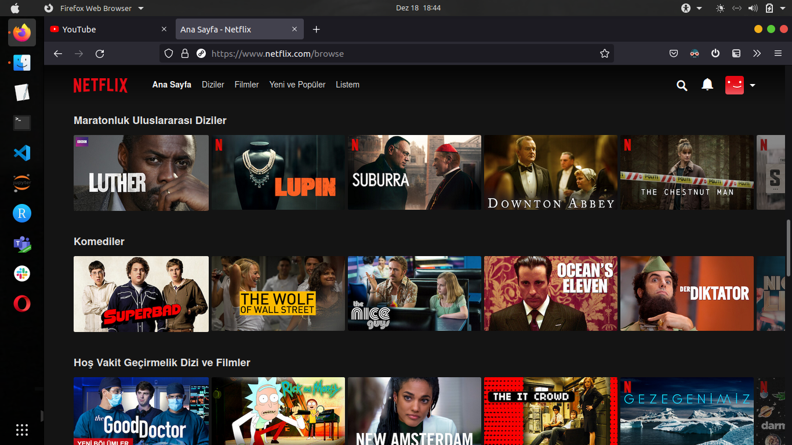
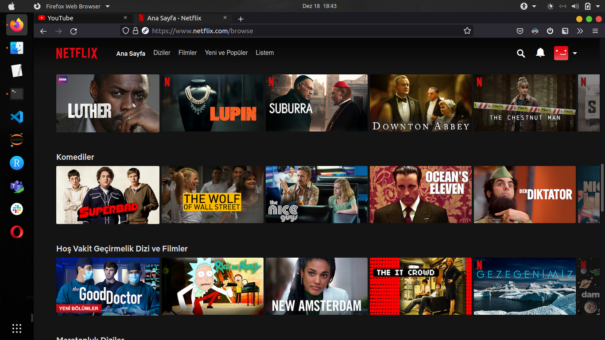

# firefox-extracompact-stylesheet
A simple userChrome stylesheet for an extra-compact Firefox view

Default:

Extra-Compact:

Setup:
1- In your Firefox profile directory, create a directory named "chrome".
2- Copy the stylesheet in this directory.
3- Open Firefox and go to "about:config".
4- Search for "toolkit.legacyUserProfileCustomizations.stylesheets" and set it to true.
5- Search for "browser.uidensity" and set it to 1.
6- Restart the browser.